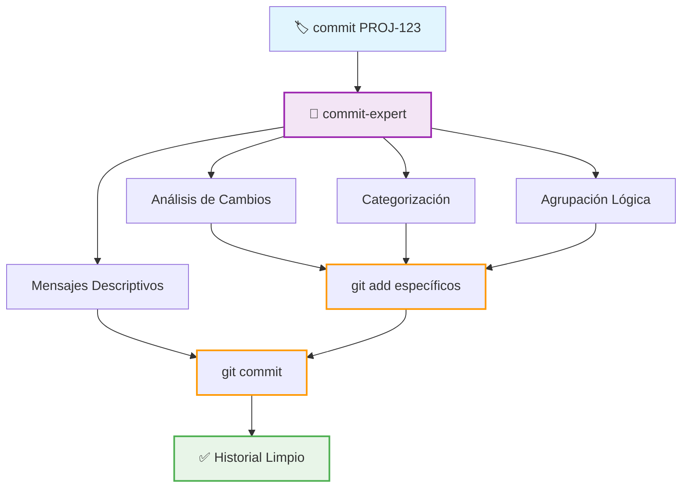

# 🏷️ Commit

Comando para ejecutar commits organizados de todos los cambios implementados, utilizando el experto en commits para categorizar, agrupar y generar mensajes descriptivos siguiendo conventional commits. Este comando NO crea PR; está enfocado únicamente en generar un historial de commits profesional y atómico.

## 🎯 Objetivo

Crear un historial de git limpio y profesional:
1. Analizar todos los cambios implementados con el commit-expert
2. Categorizar archivos según tipo de cambio (features, bugfixes, refactor, etc.)
3. Agrupar archivos en commits atómicos y lógicos
4. Ejecutar commits organizados con mensajes descriptivos
5. Referenciar tickets y documentación relacionada

## 🚀 Uso

```bash
# Comando principal - siempre crea commits organizados
rovodev commit PROJ-123
```

## 📋 Parámetros

Subagente utilizado: commit-expert (ver .rovodev/subagents/commit-expert.md)

- `ticket_id`: ID del ticket de Jira (obligatorio)

Nota: Este comando siempre ejecuta commits organizados de manera atómica y secuencial para asegurar un historial limpio.

## 🏗️ Arquitectura del Comando



## 🔍 Proceso Paso a Paso

### Paso 1: Consulta al Experto en Commits

Delega al commit-expert el análisis completo de todos los cambios en el workspace:

"Analiza todos los archivos modificados en el workspace actual y genera commits organizados siguiendo conventional commits. El ticket relacionado es [ticket_id]. Necesito que categorices todos los cambios, los agrupes de manera lógica y atómica, y generes mensajes de commit descriptivos con el contexto completo del ticket."

El experto en commits proporcionará:
- Categorización completa de todos los archivos modificados
- Agrupación lógica de archivos en commits atómicos
- Mensajes de commit siguiendo conventional commits
- Orden apropiado de commits respetando dependencias
- Referencias cruzadas con el ticket de Jira

### Paso 2: Ejecución de Commits Organizados

Ejecuta los commits en el orden exacto proporcionado por el experto:

1. Stage archivos específicos para cada commit según agrupación del experto
2. Ejecuta commit con el mensaje exacto proporcionado por el experto
3. Valida que cada commit se ejecutó correctamente
4. Continúa con el siguiente commit en secuencia
5. Verifica que todos los cambios fueron committeados

Guía de ejecución (pseudo-proceso):

- Para cada grupo de archivos propuesto:
  - `git add <lista_de_archivos>`
  - `git commit -m "<titulo>" -m "<cuerpo>" -m "<footer>"`
  - Si falla, revisar el grupo, ajustar staging y reintentar

### Paso 3: Validación Final

Verifica que el proceso se completó correctamente:

1. Confirma que no quedan archivos sin committear
2. Revisa que el historial de commits sigue conventional commits
3. Valida que las referencias a tickets están presentes
4. Reporta resumen de commits creados

## 📊 Resultado Esperado

Al completar este proceso, tendrás:

### ✅ Commits Profesionales
- Historial de git limpio con commits atómicos
- Mensajes descriptivos siguiendo conventional commits
- Agrupación lógica que facilita rollbacks y navegación
- Referencias cruzadas con ticket de Jira
- Secuencia ordenada respetando dependencias

### ✅ Categorización Clara
- Features agrupadas apropiadamente
- Bugfixes separados de features nuevas
- Refactoring organizado lógicamente
- Tests asociados con sus componentes
- Documentación actualizada coherentemente

### ✅ Trazabilidad
- Cada commit referencia el ticket de origen
- Mensajes proporcionan contexto completo
- Historial facilita debugging futuro
- Rollbacks pueden hacerse granularmente

## 🎯 Beneficios

- Atomicidad: Cada commit representa una unidad completa y funcional de trabajo.
- Claridad: Los mensajes explican qué, por qué y cómo de manera comprensible.
- Navegabilidad: El historial es fácil de revisar y entender.
- Revertibilidad: Cambios pueden revertirse granularmente sin afectar trabajo no relacionado.
- Consistencia: Todos los commits siguen el mismo estándar profesional.

Este comando asegura que el historial de git refleje profesionalmente el trabajo realizado, facilitando mantenimiento, debugging y colaboración futura.
